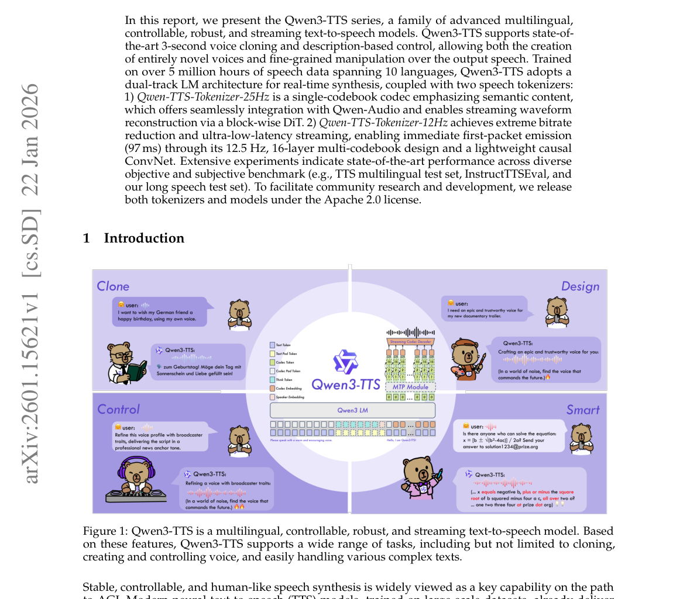
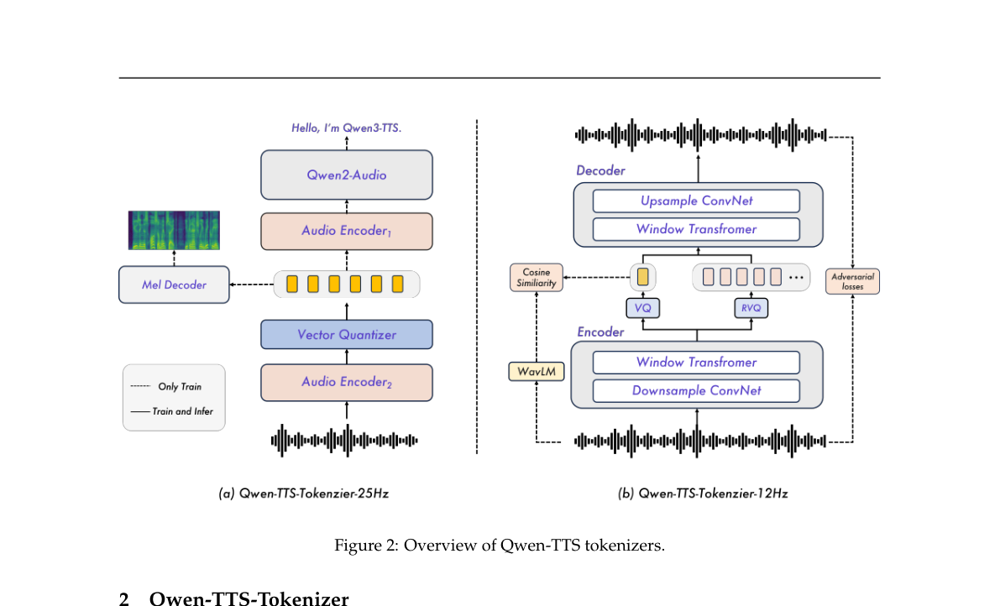
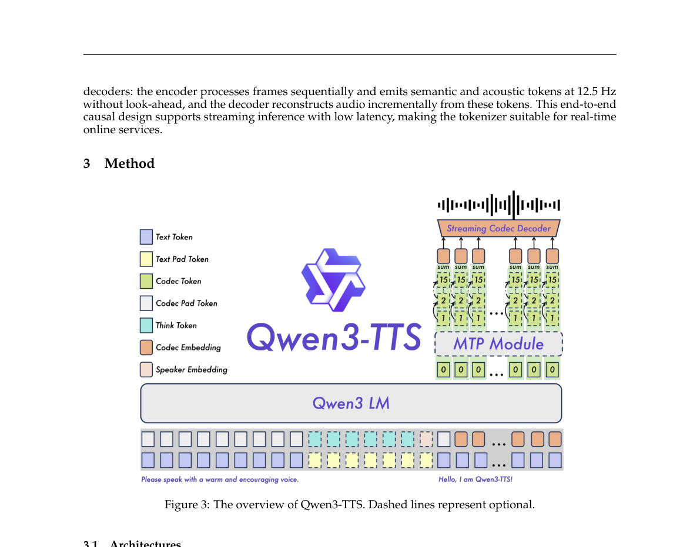

# 📄 논문 분석: 2601.15621

* **원문 링크:** [https://arxiv.org/abs/2601.15621](https://arxiv.org/abs/2601.15621)
* **사용 모델:** gemini-flash-lite-latest

---
## Qwen3-TTS 기술 보고서 핵심 요약

### 1. 🎯 연구 목적 (Why)
본 연구의 목적은 **다국어 지원, 제어 가능성(Controllability), 안정성, 실시간 스트리밍** 기능을 모두 갖춘 최첨단 텍스트-음성 변환(TTS) 모델 시리즈인 **Qwen3-TTS**를 개발하고 제시하는 것입니다. 특히, 3초 만에 음성을 복제하는 기능(Voice Cloning)과 자연어 설명을 통한 정밀한 음성 속성 제어를 목표로 합니다. 기존 TTS 모델들이 가진 안정성, 제어 가능성, 자연스러움, 다국어 지원, 그리고 실시간 스트리밍 요구사항을 동시에 충족하는 것을 주요 과제로 설정했습니다.

### 2. 🛠️ 연구 방법론 (How)
Qwen3-TTS는 **듀얼 트랙(Dual-Track) 언어 모델(LM) 아키텍처**를 채택하여 실시간 합성을 지원하며, 1천만 시간 분량의 다국어 음성 데이터로 훈련되었습니다. 핵심은 두 가지 종류의 음성 토크나이저 사용과 이들을 기반으로 한 이중 구조 접근 방식입니다.

1. **Qwen-TTS-Tokenizer-25Hz**:
    * **특징**: 단일 코드북(Single-codebook) 구조로, 의미론적 내용(Semantic Content)에 중점을 둡니다.
    * **구조**: Qwen2-Audio 인코더를 활용하며, 스트리밍 재구축을 위해 블록 기반의 **Diffusion Transformer (DiT)**와 Flow Matching을 사용합니다.
    * **제한점**: 초저지연 스트리밍에는 덜 적합합니다.

2. **Qwen-TTS-Tokenizer-12Hz**:
    * **특징**: **12.5Hz의 다중 코드북(Multi-codebook) 설계**를 사용하여 극단적인 비트레이트 감소와 초저지연 스트리밍을 달성합니다.
    * **구조**: 첫 번째 코드북은 의미론적 내용을, 후속 레이어들은 음향적 세부 정보를 포착합니다 (Mimi 아키텍처에서 영감). 복잡한 확산 모델 대신 **가벼운 인과형 ConvNet**을 사용하여 파형을 재구성합니다.
    * **스트리밍**: 순수 인과형(Fully Causal) 디코더를 사용해 첫 번째 패킷을 **97ms** 만에 방출할 수 있습니다. **다중 토큰 예측(MTP)** 모듈을 통해 다중 코드북 시퀀스를 효율적으로 모델링합니다.

* **전체 훈련**: ChatML 형식을 사용하여 3단계 사전 훈련(일반, 고품질 데이터 CPT, 장문맥)과 3단계 사후 훈련(DPO, GSPO, 경량 스피커 파인튜닝)을 거쳐 자연스러움과 안정성을 극대화했습니다.

### 3. 💡 주요 결과 (What)
Qwen3-TTS는 광범위한 벤치마크에서 최첨단(State-of-the-Art, SOTA) 성능을 입증했습니다.

* **제로샷 음성 복제 (Zero-Shot Voice Cloning)**: Seed-TTS 벤치마크에서 가장 낮은 WER(Word Error Rate)을 달성했습니다. 특히, **Qwen3-TTS-12Hz-1.7B-Base** 모델이 test-en 셋에서 **WER 1.24**를 기록하며 SOTA를 갱신했습니다.
* **다국어 성능**: 10개 언어 평가에서 MiniMax 및 ElevenLabs와 비교하여 6개 언어에서 더 나은 내용 일관성(WER)을 보였으며, **모든 10개 언어에서 최고의 화자 유사도(Speaker Similarity)** 점수를 기록했습니다.
* **교차 언어 복제 (Cross-Lingual)**: zh-to-ko 시나리오에서 CosyVoice3 대비 오류율을 약 66% 감소시켜 뛰어난 교차 언어 일반화 능력을 보였습니다.
* **제어 가능성 (Controllability)**: InstructTTSEval에서 음성 디자인(Voice Design) 시나리오에서 오픈소스 모델 중 SOTA를 달성했으며, GPT-4o-mini-tts보다 Target Speaker 편집 성능이 현저히 우수했습니다.
* **스트리밍 효율성**: **Qwen3-TTS-12Hz** 계열은 1x 동시 접속 시 **최소 97ms**의 초저 첫 패킷 지연 시간(First-Packet Latency)을 달성했습니다.

### 4. 🧠 핵심 인사이트
Qwen3-TTS는 고품질 TTS를 위해 **해상도(25Hz vs 12Hz)와 코드북 구조(단일 vs 다중)에 따른 명확한 트레이드오프**를 설정하고, 이를 병렬 아키텍처로 효과적으로 통합했다는 점이 핵심입니다.

* **저지연 스트리밍의 열쇠는 저해상도 다중 코드북**: 12Hz 토크나이저는 낮은 샘플링 속도에도 불구하고 다중 코드북 구조 덕분에 내용 일관성(WER)은 25Hz보다 우수했으며, 순수 인과적 디코딩이 가능하여 극도로 낮은 첫 패킷 지연 시간(97ms)을 실현했습니다. 이는 LLM과의 통합 및 실시간 서비스에 매우 유리한 특성입니다.
* **컨트롤 가능성의 LLM화**: 음성 제어를 텍스트 지침(ChatML 형식)으로 처리함으로써, 모델이 언어 이해 능력을 활용하여 새로운 목소리를 생성하거나(Voice Design) 기존 음성을 정밀하게 편집하는(Voice Editing) 능력을 확보했습니다.
* **실무 적용 아이디어**: 12Hz 모델은 실시간 고객 지원 챗봇, 스트리밍 오디오북, 라이브 방송 더빙 등 초저지연이 필수적인 분야에 최적화되어 있습니다. 25Hz 모델은 음향 디테일과 의미론적 융합이 중요한 고품질 콘텐츠 생성에 적합합니다.

---
### 🖼️ 주요 그림 및 표 (Figures)

> **Figure 1: Qwen3-TTS is a multilingual, controllable, robust, and streaming text-to-speech model. Based
on these features, Qwen3-TTS supports a wide range of tasks, including but not limited to cloning,
creating and controlling voice, and easily handling various complex texts.**

 

> **Figure 2: Overview of Qwen-TTS tokenizers.**

 

> **Figure 3: The overview of Qwen3-TTS. Dashed lines represent optional.**

 

