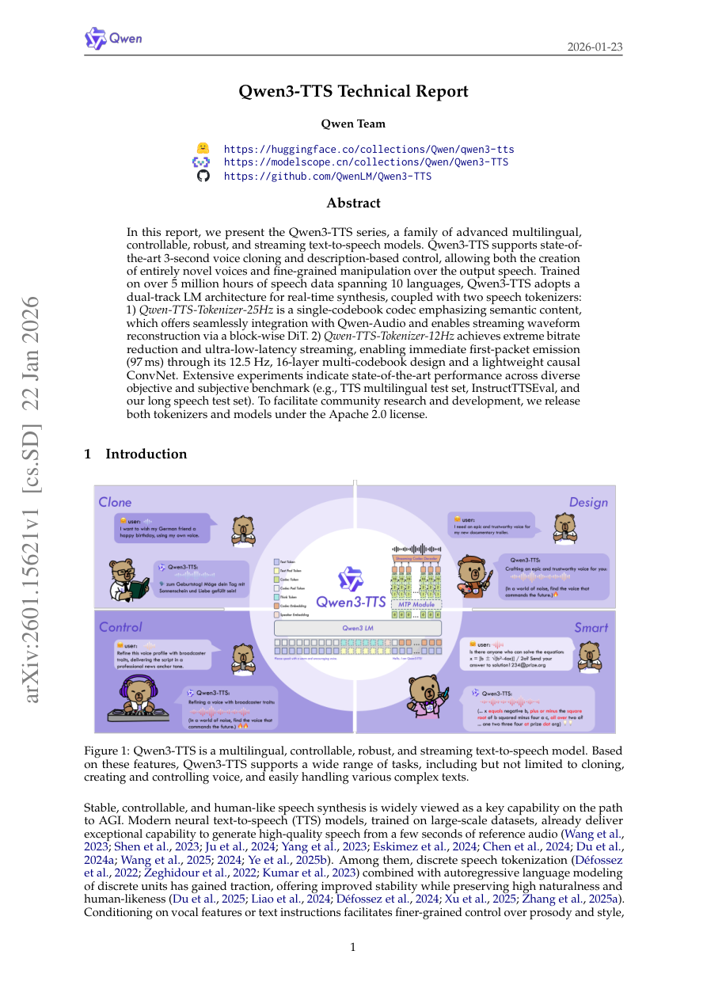

# Analysis: 2601_15621

## Qwen3-TTS 기술 보고서 핵심 요약 (2026-01-23)

**Qwen3-TTS**는 Alibaba Qwen 팀에서 개발한 **다국어, 제어 가능, 견고하며 스트리밍이 가능한 차세대 텍스트-음성 변환(Text-to-Speech, TTS) 모델 시리즈**입니다. 기존 모델 대비 뛰어난 성능과 실용성을 목표로 설계되었습니다.

### 1. 주요 특징 및 성능

* **최첨단 음성 복제:** 단 **3초 분량**의 짧은 오디오만으로 음성을 복제(Voice Cloning)할 수 있습니다.
* **세밀한 제어 능력:** 자연어 설명(Description-based Control)을 통해 완전히 새로운 목소리를 생성하거나 출력 음성의 운율 및 스타일을 세밀하게 조작할 수 있습니다.
* **대규모 다국어 지원:** **10개 언어**에 걸쳐 500만 시간 이상의 음성 데이터로 훈련되어, 화자 일관성을 유지하며 다국어 음성 합성이 가능합니다.
* **실시간 스트리밍:** 텍스트 입력부터 오디오 출력까지 스트리밍을 지원하며, **최저 97ms**의 초저지연(ultra-low-latency) 성능을 달성합니다.
* **최고 성능 달성:** 다양한 벤치마크(TTS 다국어 테스트 세트, InstructTTSEval 등)에서 **최첨단(State-of-the-Art, SOTA)** 성능을 기록했습니다. 특히 제로샷 음성 복제 WER 및 다국어 화자 유사성에서 상업적 모델을 능가합니다.

### 2. 핵심 기술 구성: 듀얼 토크나이저 아키텍처

Qwen3-TTS는 실시간 합성 및 LLM과의 원활한 통합을 위해 두 가지 유형의 이산 음성 토크나이저를 도입했습니다.

1. **Qwen-TTS-Tokenizer-25Hz (단일 코드북):**
    * **특징:** 25Hz의 샘플링 속도(40ms/토큰)를 가지며, **의미론적 내용**에 중점을 둔 단일 코드북을 사용합니다.
    * **합성:** 블록 기반의 DiT(Diffusion Transformer)를 사용하여 파형을 재구성하며 스트리밍을 지원합니다.
    * **트레이드오프:** 스트리밍에는 적합하나, 초저지연 환경에서는 향후 토큰을 기다려야 하는 제약(약 190ms 초기 지연)이 있어 12Hz 모델 대비 불리합니다.

2. **Qwen-TTS-Tokenizer-12Hz (다중 코드북):**
    * **특징:** **12.5Hz**의 매우 낮은 샘플링 속도(80ms/토큰)를 가지며, **다중 코드북(Multi-Codebook)** 방식을 채택합니다. 이는 의미론적 코드북과 음향적 디테일을 포착하는 후속 코드북으로 구성됩니다.
    * **합성:** 경량의 인과형(Causal) ConvNet만으로 파형을 재구성하며, **선행 토큰만으로 즉시** 디코딩이 가능합니다.
    * **효율성:** 이 디자인 덕분에 **97ms**의 가장 낮은 최초 패킷 지연 시간을 달성했으며, 초저지연 실시간 서비스에 매우 유리합니다.

### 3. 훈련 전략

모델 훈련은 일반적인 사전 훈련과 이후의 정제를 포함합니다.

* **사전 훈련 (Pre-training):** 5백만 시간 데이터로 일반 단계(S1) 훈련 후, 고품질 데이터만을 선별한 **지속적 사전 훈련(CPT, S2)**을 통해 노이즈로 인한 환각을 줄이고 음성 품질을 향상시킵니다. 최종적으로 토큰 길이를 늘려 장문 처리 능력(S3)을 강화합니다.
* **사후 훈련 (Post-training):** **DPO(Direct Preference Optimization)**를 적용하여 인간 선호도에 맞추고, GSPO 및 경량 화자 미세 조정(Speaker Fine-tuning)을 통해 자연스러움, 표현력, 제어 능력을 최적화합니다.

### 4. 주요 실험 결과 요약

* **제로샷 생성:** 1.7B 모델은 Seed-TTS 벤치마크에서 **WER 1.24**를 기록하며 SOTA를 달성했습니다. 12Hz 변형이 25Hz 변형보다 장기 의존성 모델링에 유리하여 정확도가 높았습니다.
* **다국어 생성:** 10개 언어 중 6개에서 WER이 가장 낮았으며, **모든 언어에서 상업적 베이스라인보다 높은 화자 유사도(SIM)** 점수를 기록했습니다.
* **교차 언어 생성:** 중국어(zh)를 한국어(ko)로 변환하는 경우 **오류율을 66% 감소**시키는 등 뛰어난 교차 언어 일반화 능력을 보여주었습니다.
* **제어 가능 생성:** InstructTTSEval에서 음성 디자인(Voice Design) 시 오픈소스 모델 중 SOTA를 달성했으며, GPT-4o-mini-tts 대비 월등한 성능으로 지침(Instruction)을 따랐습니다.
* **효율성:** 12Hz 모델은 25Hz 모델보다 LM 추론 시간이 더 빠르고, 토크나이저 디코딩 지연 시간이 극히 낮아 (1.7B 모델 기준) **최대 6배 동시 접속 시에도 333ms**의 준수한 최초 패킷 지연 시간을 유지했습니다.

---
### Figures & Snapshots

