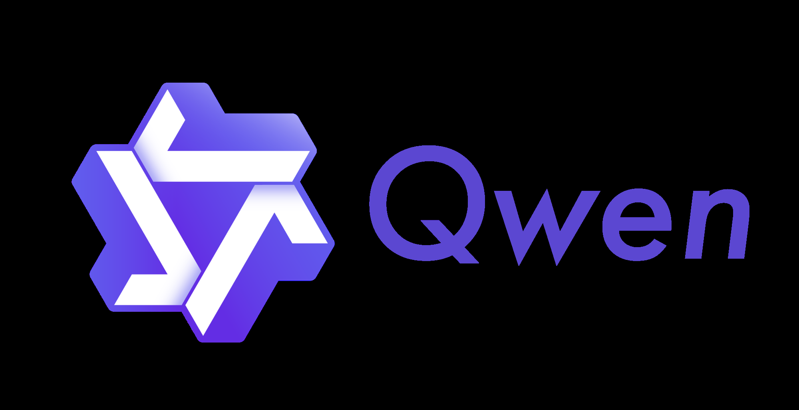
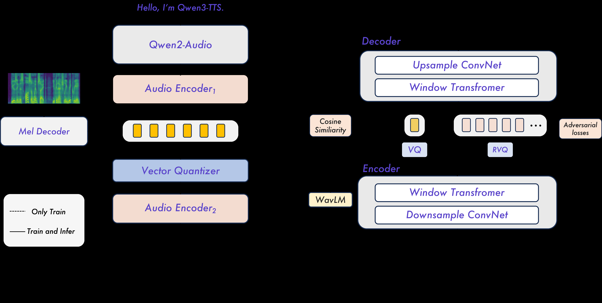

# 📄 Qwen3-TTS Technical Report

* **저자 / 기관 / 발행년도:** Hangrui Hu, Xinfa Zhu, Ting He, Dake Guo, Bin Zhang, Xiong Wang, Zhifang Guo, Ziyue Jiang, Hongkun Hao, Zishan Guo, Xinyu Zhang, Pei Zhang, Baosong Yang, Jin Xu, Jingren Zhou, Junyang Lin / 2026
* **원문 링크:** [https://arxiv.org/abs/2601.15621](https://arxiv.org/abs/2601.15621)
* **분석 모델:** gemini-flash-lite-latest

#### 1. 📖 Abstract
* **Original:** In this report, we present the Qwen3-TTS series, a family of advanced multilingual, controllable, robust, and streaming text-to-speech models. Qwen3-TTS supports state-of-the-art 3-second voice cloning and description-based control, allowing both the creation of entirely novel voices and fine-grained manipulation over the output speech. Trained on over 5 million hours of speech data spanning 10 languages, Qwen3-TTS adopts a dual-track LM architecture for real-time synthesis, coupled with two speech tokenizers: 1) Qwen-TTS-Tokenizer-25Hz is a single-codebook codec emphasizing semantic content, which offers seamlessly integration with Qwen-Audio and enables streaming waveform reconstruction via a block-wise DiT. 2) Qwen-TTS-Tokenizer-12Hz achieves extreme bitrate reduction and ultra-low-latency streaming, enabling immediate first-packet emission ($97\,\mathrm{ms}$) through its 12.5 Hz, 16-layer multi-codebook design and a lightweight causal ConvNet. Extensive experiments indicate state-of-the-art performance across diverse objective and subjective benchmark (e.g., TTS multilingual test set, InstructTTSEval, and our long speech test set). To facilitate community research and development, we release both tokenizers and models under the Apache 2.0 license.

---
## Qwen3-TTS Technical Report 분석

#### 2. 🎯 연구 목적 (Why)
* **이 연구가 해결하고자 하는 기존의 문제점이나 배경은 무엇인가?**
    * Stable(안정적), controllable(제어 가능), human-like(인간과 유사한) speech synthesis(음성 합성)는 AGI(범용 인공지능)로 가는 핵심 역량으로 여겨집니다.
    * 기존의 neural text-to-speech (TTS) 모델은 고품질 음성 생성 능력을 갖추었으나, 더욱 정교한 prosody 및 style 제어(conditioning on vocal features or text instructions)와 실시간 스트리밍(real-time synthesis) 및 LLM과의 원활한 통합이 중요한 과제로 남아 있었습니다.
    * 특히, ultra-low-latency streaming을 위해선 토크나이저 설계(예: semantic tokenizer의 낮은 표현력 또는 acoustic tokenizer의 복잡성 문제)와 지연 시간 최적화가 필요합니다.

#### 3. 🛠️ 연구 방법론 (How)
* **Core Idea:**
    * Qwen3-TTS는 대규모(5백만 시간 이상) 다국어 음성 데이터로 훈련된, multilingual(다국어), controllable(제어 가능), robust(견고), streaming(스트리밍)을 지원하는 TTS 모델 시리즈입니다.
    * **Dual-track LM architecture**를 채택하여 실시간 합성을 지원합니다.
    * **Controllability 및 Voice Cloning:** 자연어 설명을 통해 새로운 voice를 생성하거나 기존 음성의 fine-grained attribute를 조작할 수 있으며, 3초 voice cloning을 지원합니다.
    * **Two Speech Tokenizers:**
        1. **Qwen-TTS-Tokenizer-25Hz:** 25 Hz의 single-codebook codec을 사용하여 semantic content를 강조하며, block-wise DiT를 통해 streaming waveform reconstruction을 가능하게 합니다.
        2. **Qwen-TTS-Tokenizer-12Hz:** 12.5 Hz의 16-layer multi-codebook design을 사용하여 extreme bitrate reduction 및 ultra-low-latency streaming을 달성하며, lightweight causal ConvNet으로 waveform reconstruction을 수행합니다.
    * **훈련:** 3단계 Pre-training (General, High-Quality, Long-Context)과 3단계 Post-training (DPO, GSPO, lightweight speaker fine-tuning)을 거칩니다.
* **Model Architecture:**
    * **Backbone:** Qwen3 LM family를 활용합니다. Text는 Qwen tokenizer로, speech는 Qwen-TTS-Tokenizer로 인코딩됩니다.
    * **Streaming Synthesis:** 텍스트 및 acoustic token을 channel axis를 따라 concatenate하는 dual-track representation을 사용합니다. 텍스트 토큰 수신 시, 모델은 즉시 해당 acoustic token을 예측하고, Code2Wav 모듈이 waveform으로 변환합니다.
    * **Qwen3-TTS-25Hz:** 단일 레벨 speech token을 사용하며, chunk-wise DiT 모듈을 통해 고충실도(high-fidelity) waveform reconstruction을 수행합니다.
    * **Qwen3-TTS-12Hz:** RVQ token을 사용하며, MTP (Multi-Token Prediction) 모듈이 잔여 codebook들을 생성하는 계층적 예측(hierarchical prediction) 방식을 채택합니다.

#### 4. 💡 주요 결과 (What)
* **Dataset & Evaluation:**
    * **데이터셋:** 10개 언어에 걸친 5백만 시간 이상의 speech data로 훈련되었습니다.
    * **평가 벤치마크:** TTS multilingual test set, InstructTTSEval, Seed-TTS benchmark, CV3-Eval, 내부 long speech test set 등을 사용했습니다.
    * **평가 지표:** WER (Word Error Rate), Speaker Similarity (SIM), APS, DSD, RP, STOI, PESQ, UTMOS 등을 사용했습니다.
* **Experimental Results:**
    * **Tokenizer 성능:** Qwen-TTS-Tokenizer-12Hz는 STOI(0.96), PESQ_NB(3.68), SIM(0.95) 등에서 기존 semantic-aware methods 대비 SOTA를 달성했습니다.
    * **Zero-Shot Cloning:** Qwen3-TTS-12Hz-1.7B-Base는 Seed-TTS test-en에서 WER 1.24를 달성하며 SOTA를 기록했습니다.
    * **Multilingual Generation:** 10개 언어 중 6개 언어(중국어, 영어, 이탈리아어, 프랑스어, 한국어, 러시아어)에서 WER이 MiniMax-Speech 및 ElevenLabs 대비 우수했으며, 10개 언어 모두에서 Speaker Similarity가 두 baseline 모델보다 높았습니다.
    * **Cross-Lingual Generation:** zh-to-ko 생성에서 CosyVoice3 대비 오류율을 약 66% 감소시켰습니다 (4.82 vs 14.4).
    * **Controllable Generation:** Voice Design(Voice Design) 시나리오에서 Qwen3-TTS-12Hz-1.7B-VD가 오픈소스 모델 중 SOTA를 달성했으며, Target Speaker Editing 시나리오에서는 GPT-4o-mini-tts 대비 중국어에서 APS가 28% 향상되었습니다.
    * **Streaming Efficiency:** Qwen3-TTS-12Hz-0.6B 모델은 단일 환경에서 97 ms의 가장 낮은 First-Packet Latency를 기록했습니다.
    * **Long Speech Generation:** Qwen3-TTS-25Hz-1.7B-CustomVoice가 10분 이상의 긴 음성에서 WER 1.533 (zh), 1.571 (en)로 가장 낮은 오류율을 보였습니다.
* **Key Findings:**
    1. Qwen3-TTS는 3초 voice cloning, description-based control, 스트리밍 기능을 통합한 단일 autoregressive framework를 제공합니다.
    2. Qwen-TTS-Tokenizer-12Hz는 낮은 temporal resolution(12.5 Hz)과 multi-codebook 설계를 통해 ultra-low-latency streaming(97 ms) 및 우수한 음질(높은 SIM)을 동시에 달성했습니다.
    3. 훈련 시 DPO 및 GSPO와 같은 사후 훈련(post-training) 단계를 도입하여 human preference 정렬 및 task 전반의 안정성(특히 10분 이상의 장문 합성)을 크게 향상시켰습니다.

#### 5. ⚠️ 한계점 및 향후 과제
* **Limitations:**
    * **(1) 논문에서 저자가 밝힌 한계점:** 논문 본문에서 명시적으로 주요 한계점으로 지적된 내용은 나타나지 않으나, 25Hz Tokenizer는 ultra-low-latency 애플리케이션에는 12Hz Tokenizer보다 덜 적합하다고 언급되었습니다. 또한, 12Hz 변형 모델이 장문 생성(Long Speech Generation)에서는 25Hz 변형보다 WER이 높게 나타나, 토크나이저 선택에 따른 trade-off가 존재함을 시사합니다.
    * **(2) 분석가(AI)의 견해:** 상업용 baseline(예: ElevenLabs, GPT-4o) 대비 특정 언어(예: 포르투갈어, 이탈리아어 등)에서 여전히 WER이 높거나, Control task(예: Target Speaker Editing)에서 Gemini 시리즈가 여전히 상한선으로 남아있습니다.
* **Future Work:**
    * **(1) 논문에서 저자가 밝힌 향후 과제:** 아키텍처를 확장하여 versatile audio generation(다목적 오디오 생성)을 지원하고, 현재 10개 언어 이상으로 multilingual coverage를 확장하며, 보다 granular stylistic control을 탐색할 계획입니다.
    * **(2) 분석가(AI)의 견해:** 다양한 언어에서 일관되게 SOTA를 유지하기 위한 데이터셋 확장 및 모델 안정성 강화, 특히 12Hz와 25Hz 토크나이저 간의 장단점을 통합할 수 있는 새로운 아키텍처 탐색이 필요합니다.

#### 6. 🧠 핵심 인사이트
* **Significance:** Qwen3-TTS는 대규모 데이터 기반의 다국어 지원, 3초 voice cloning, fine-grained description-based control, 그리고 실시간 스트리밍 성능을 하나의 autoregressive framework 내에 성공적으로 통합한 점이 중요합니다. 특히, 12Hz multi-codebook 토크나이저와 듀얼 트랙 LM 구조를 통해 초저지연 스트리밍과 고품질을 양립시킨 것은 TTS 분야의 중요한 진전입니다.
* **Practical Application:** 3초 만에 target voice를 cloning할 수 있는 기능은 실시간 voice assistant나 고객 서비스 자동화에서 즉각적인 voice persona 구축에 매우 유용합니다. 또한, 자연어 설명(description)을 통한 voice design/editing 기능은 콘텐츠 제작 과정에서 원하는 스타일과 톤을 세밀하게 제어하는 데 활용될 수 있습니다.

#### 7. 🔗 기타
* **Code:** https://github.com/QwenLM/Qwen3-TTS
* **Demo:** 논문에서 명시되지 않음

#### 8. 📑 논문 전체 목차
* **Table of Contents:**
    * Abstract
    * 1 Introduction
    * 2 Qwen-TTS Tokenizer
        * 2.1 Qwen-TTS-Tokenizer-25Hz
        * 2.2 Qwen-TTS-Tokenizer-12Hz
    * 3 Method
        * 3.1 Architectures
        * 3.2 Training
        * 3.3 Features
        * 3.4 Efficiency
    * 4 Experiments
        * 4.1 Evaluation of Speech Tokenizer
            * 4.1.1 Qwen-TTS-Tokenizer-25Hz
            * 4.1.2 Qwen-TTS-Tokenizer-12Hz
        * 4.2 Speech Generation
            * 4.2.1 Evaluation of Zero-Shot Speech Generation
            * 4.2.2 Evaluation of Multilingual Speech Generation
            * 4.2.3 Evaluation of Cross-Lingual Speech Generation
            * 4.2.4 Evaluation of Controllable Speech Generation
            * 4.2.5 Evaluation of Target-Speaker Speech Generation
            * 4.2.6 Evaluation of Long Speech Generation
    * 5 Conclusion
    * 6 Authors

---
#### 🖼️ 추출된 주요 그림 및 표

